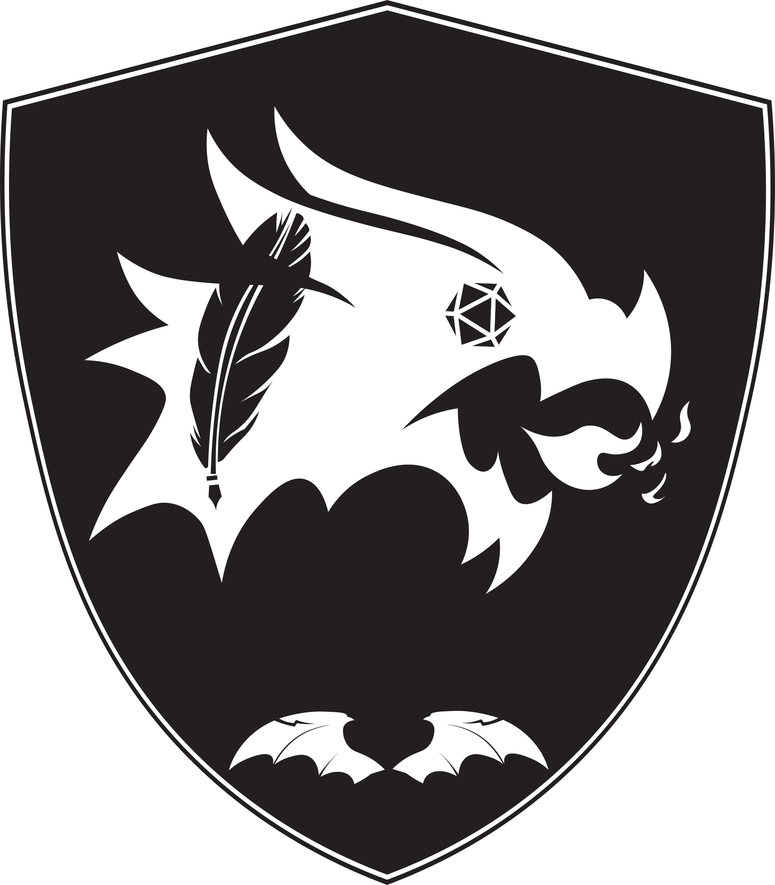

<p align="center">
  
</p>

<h1 align="center">Draconae Project</h1>

<p align="center">
  <em>Your digital companion for creating and managing <a href="https://www.dndbeyond.com" target="_blank">Dungeons & Dragons</a> 5th Edition characters!</em>
  <br><br>
  <a href="https://github.com/KoRIOz675/Draconae-Project/actions">
    
  </a>
  
  <a href="LICENSE">
    
  </a>
</p>

---

## 📜 Table of Contents

- [📖 About The Project](#-about-the-project)
    - [🛠️ Built With](#️-built-with)
- [✨ Core Features](#-core-features)
- [🛠️ Development Progress](#️-development-progress)
    - [🚧 Currently In Focus](#-currently-in-focus)
    - [✨ Recently Added](#-recently-added)
    - [🚀 Future Enhancements](#-future-enhancements)
- [💡 Important Note](#-important-note)
- [🏁 Getting Started](#-getting-started)
    - [Prerequisites](#prerequisites)
    - [Installation & Running](#installation--running)
- [🤝 Contributing](#-contributing)
- [🙏 Acknowledgements](#-acknowledgements)
- [📄 License](#-license)

---

## 📖 About The Project

**Draconae Project** is a desktop application designed to streamline the creation and management of your Dungeons & Dragons 5th Edition characters. 

This application uses game data provided by the official D&D 5.1 Systems Reference Document (SRD).

### 🛠️ Built With

This project leverages the power of:

- [](https://www.java.com)
- [](https://openjfx.io/) - For the graphical user interface.
- [](https://maven.apache.org/) - For project build and dependency management.
- [](https://github.com/FasterXML/jackson) - For JSON data handling.
- [](https://mkpaz.github.io/atlantafx/) - For UI theming.
- **5e SRD API Data** - For the core game rules data in JSON format.

---

## ✨ Core Features

Draconae Project is being developed to include the following key functionalities:

- **Full Character Creation:** A step-by-step wizard to build your character from the ground up, including name, species, sub-species, class, and ability scores.
- **Character Persistence:** All character data is saved to a local JSON file, allowing you to close the app and load your character later.
- **Interactive Character Sheet:** The main display screen acts as a dynamic character sheet with the following capabilities:
    - **Health Management:** Apply damage, healing, and temporary HP with the click of a button.
    - **Ability & Saving Throw Rolls:** Roll saving throws with correctly calculated modifiers and proficiency bonuses.
    - **Attack Rolls:** Perform attack rolls using the appropriate ability modifier and proficiency.
    - **XP and Leveling:** Add XP, track your progress to the next level with a progress bar, and automatically level up when the threshold is met.
    - **Basic Inventory Management:** Add any weapon, armor, or tool from the SRD to your character's inventory.


---

## 🛠️ Development Progress

### 🚧 Currently In Focus

We are actively working on:

- **Advanced Inventory & Equipment:** Implementing equipping/unequipping items and calculating Armor Class (AC).
- **Implementing Skill Checks:** Adding a system to perform and roll for skills like Stealth, Persuasion, and Athletics.
- **UI/UX Polish:** Improving the layout and usability of the character display screen.

### ✨ Recently Added

The newest features integrated into the project:

- **SRD Data Integration:** The entire application now runs on data from the official 5e Systems Reference Document, ensuring accuracy and compliance.
- **Interactive Actions Panel:** Added UI controls to the character sheet to manage HP, roll dice, and add XP during a game.
- **XP Progress and Level-Up System:** Characters now have a functional XP bar and will automatically level up, recalculating stats like proficiency bonus.
- **Dynamic Proficiency Display:** The character sheet now correctly displays all proficiencies gained from class and race.
- **Full Character Creation Pipeline:** The multi-step creation process is complete, from naming your character to rolling their final stats.

### 🚀 Future Enhancements

Once the core application is stable, we plan to expand with:

- **Full Skill Check Implementation.**
- **Spellbook Management for spellcasting classes.**
- **Expanded Content:** Incorporating feats, backgrounds, and more complex character choices.
- **A comprehensive, multi-tab character sheet view.**

---

## 💡 Important Note

Draconae Project is a tool to help you play D&D, but it **does not replace official source material.** The game data used in this application is from the **D&D 5.1 Systems Reference Document (SRD)** and is used under the terms of the **Creative Commons Attribution 4.0 International License**.


> [!NOTE]
> This work includes material taken from the System Reference Document 5.1 (“SRD 5.1”) by Wizards of the Coast LLC and available at https://dnd.wizards.com/resources/systems-reference-document. The SRD 5.1 is licensed under the Creative Commons Attribution 4.0 International License available at https://creativecommons.org/licenses/by/4.0/legalcode.

---

## 🏁 Getting Started

To get a local copy up and running, follow these simple steps.

### Prerequisites

- **Java Development Kit (JDK)** - Version 11 or higher.
- **Apache Maven** - Version 3.6 or higher.
    - Verify installation: `mvn --version`
- **Git** - For cloning the repository.

### Installation & Running

1.  **Clone the repo:**
    ```bash
    git clone https://github.com/KoRIOz675/Draconae-Project.git
    ```
2.  **Navigate to the project directory:**
    ```bash
    cd Draconae-Project
    ```
3.  **Build the project using Maven:**
    ```bash
    mvn clean package
    ```
4.  **Run the application:**
    ```bash
    mvn javafx:run
    ```

---

## 🤝 Contributing

Contributions are what make the open-source community such an amazing place to learn, inspire, and create. Any contributions you make are **greatly appreciated**.

Please see our [**CONTRIBUTING.md**](CONTRIBUTING.md) file for details on how to contribute to the project, including how to submit bug reports, feature requests, and pull requests.

---

## 🙏 Acknowledgements

- **UI Theme:** The visual theme used is [Primer Light](https://mkpaz.github.io/atlantafx/) from the excellent [AtlantaFX](https://mkpaz.github.io/atlantafx/) library.
- **Game Data:** This project uses SRD data sourced from the incredible [5e-srd-api-data](https://github.com/5e-bits/5e-srd-api-data) repository.
- **Wizards of the Coast:** For creating Dungeons & Dragons and providing the SRD under the CC.
- [Shields.io](https://shields.io/) - For the awesome badges.

---

## 📄 License

This project is licensed under the ISC License. See the [**LICENSE**](LICENSE) file for more information. The D&D game content is used under the **Creative Commons Attribution 4.0 International License**.
